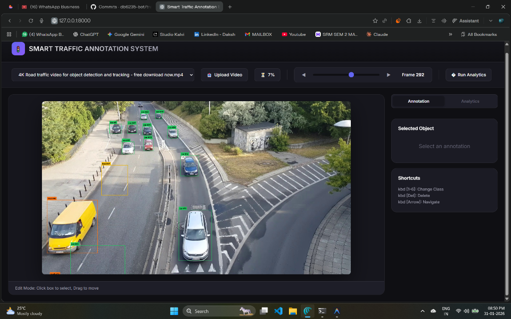

# 🚦 Smart Traffic Annotation System

<div align="center">


**AI-powered traffic video annotation system with real-time vehicle detection, tracking, and analytics**

[Features](#-features) • [Demo](#-demo) • [Installation](#-installation) • [Usage](#-usage) • [Architecture](#-architecture) • [Tech Stack](#-tech-stack)

</div>

---

## ✨ Features

- 🚗 **Automatic Vehicle Detection** - YOLOv8-powered detection for cars, trucks, buses, motorcycles, bicycles, and pedestrians
- 🔄 **Multi-Object Tracking** - DeepSORT algorithm for consistent vehicle tracking across frames
- 📊 **Traffic Analytics** - Vehicle counting with customizable counting lines
- ⚡ **Speed Estimation** - Real-world speed calculation with calibration lines
- 🛣️ **Lane Analysis** - Cut-in/cut-out detection with customizable lane zones
- ⚠️ **Safety Analysis** - Near-miss detection with Time-To-Collision (TTC) metrics
- 🎨 **Interactive Annotation Editor** - Click-to-select, drag-to-move, keyboard shortcuts
- 📤 **Multiple Export Formats** - COCO JSON, YOLO TXT, Pascal VOC XML, CSV
- ⚡ **Frame Stride Processing** - Configurable speed (1x to 10x faster processing)
- 🖥️ **Modern Web Interface** - Dark theme, real-time progress updates, 4 analysis modes

---


## 📸 Screenshots

<div align="center">



*Vehicle detection and tracking in action*

</div>

---

## 🛠️ Installation

### Prerequisites

- Python 3.9 or higher
- pip package manager
- ~2GB disk space (for ML models)

### Quick Start

```bash
# Clone the repository
git clone https://github.com/YOUR_USERNAME/traffic-annotation-system.git
cd traffic-annotation-system

# Create virtual environment
cd backend
python -m venv venv

# Activate virtual environment
# Windows:
.\venv\Scripts\activate
# Linux/Mac:
source venv/bin/activate

# Install dependencies
pip install -r requirements.txt

# Copy environment file
cp .env.example .env

# Run the server
uvicorn main:app --reload
```

### Access the Application

Open your browser and navigate to: **http://127.0.0.1:8000**

---

## 🚀 Usage

### 1. Upload a Video
Click "Upload Video" and select your traffic footage (MP4, AVI, MOV supported)

### 2. Run Auto-Label
- Select frame stride (1x-10x speed options)
- Click "Start Auto-Label"
- Wait for processing to complete

### 3. Review & Edit Annotations (Edit Mode)
- Use the frame slider to navigate
- Click boxes to select
- Keyboard shortcuts: `1-6` change class, `Del` delete

### 4. Analytics Mode
- Draw **counting lines** to count vehicles In/Out
- Draw a **calibration line** and enter real-world distance
- Click "Calculate Speeds" for speed estimation

### 5. Lanes Mode
- Draw **Ego/Left/Right lane zones** as polygons
- Click "Analyze" to detect **cut-in/cut-out** events
- Click on events to jump to specific frames

### 6. Safety Mode
- Click "Scan Video" for **near-miss detection**
- Uses Time-To-Collision (TTC) analysis
- Critical/Warning severity classification

### 7. Export
Export annotations in COCO, YOLO, VOC, or CSV format

---


## 🏗️ Architecture

```
┌─────────────────────────────────────────────────────────────┐
│                    Web Browser (Frontend)                    │
│              HTML5 Canvas + JavaScript + CSS                 │
└────────────────────────────┬────────────────────────────────┘
                             │ HTTP/REST API
┌────────────────────────────▼────────────────────────────────┐
│                   FastAPI Backend Server                     │
├─────────────────────────────────────────────────────────────┤
│  ┌──────────────┐  ┌──────────────┐  ┌──────────────┐      │
│  │   Routers    │  │   Workers    │  │   Exporters  │      │
│  │  - videos    │  │  - autolabel │  │  - COCO      │      │
│  │  - annotate  │  │  - analytics │  │  - YOLO      │      │
│  │  - frames    │  │              │  │  - VOC       │      │
│  │  - analytics │  │              │  │  - CSV       │      │
│  └──────────────┘  └──────────────┘  └──────────────┘      │
├─────────────────────────────────────────────────────────────┤
│  ┌──────────────┐  ┌──────────────┐  ┌──────────────┐      │
│  │   YOLOv8     │  │  DeepSORT    │  │   SQLite     │      │
│  │  Detection   │  │  Tracking    │  │   Database   │      │
│  └──────────────┘  └──────────────┘  └──────────────┘      │
└─────────────────────────────────────────────────────────────┘
```

---

## 🔧 Tech Stack

| Category | Technologies |
|----------|-------------|
| **Backend** | Python, FastAPI, SQLAlchemy, Pydantic |
| **AI/ML** | YOLOv8 (Ultralytics), DeepSORT, OpenCV, PyTorch |
| **Frontend** | HTML5, CSS3, JavaScript, Canvas API |
| **Database** | SQLite |
| **DevOps** | uvicorn, python-dotenv |

---

## 📁 Project Structure

```
traffic-annotation-system/
├── backend/
│   ├── main.py              # FastAPI application entry
│   ├── config.py            # Configuration settings
│   ├── database.py          # SQLAlchemy setup
│   ├── models.py            # Database models
│   ├── schemas.py           # Pydantic schemas
│   ├── crud.py              # Database operations
│   ├── autolabel_worker.py  # YOLO + DeepSORT processing
│   ├── speed_estimator.py   # Speed calculation module
│   ├── lane_events.py       # Lane change detection
│   ├── collision_detector.py # Near-miss/TTC analysis
│   ├── routers/             # API endpoints
│   │   ├── videos.py
│   │   ├── annotations.py
│   │   ├── frames.py
│   │   ├── analytics.py
│   │   ├── lanes.py
│   │   ├── safety.py
│   │   └── ...
│   ├── exporters/           # Export format handlers
│   ├── frontend/            # Static web files
│   │   └── index.html
│   └── requirements.txt
├── docs/                    # Documentation & demos
├── .env.example             # Environment template
├── .gitignore
└── README.md
```

---


## ⚙️ Configuration

Key settings in `backend/config.py`:

| Setting | Default | Description |
|---------|---------|-------------|
| `YOLO_MODEL_NAME` | `yolov8m.pt` | YOLO model (n/s/m/l/x) |
| `AUTO_DEFAULT_CONF_TH` | `0.35` | Detection confidence threshold |
| `MIN_BOX_AREA` | `800` | Minimum detection box size |
| `DEEPSORT_MAX_AGE` | `70` | Frames to keep lost tracks |

---

## 🤝 Contributing

Contributions are welcome! Please feel free to submit a Pull Request.

1. Fork the repository
2. Create your feature branch (`git checkout -b feature/AmazingFeature`)
3. Commit changes (`git commit -m 'Add AmazingFeature'`)
4. Push to branch (`git push origin feature/AmazingFeature`)
5. Open a Pull Request

---

## 📝 License

This project is licensed under the MIT License - see the [LICENSE](LICENSE) file for details.

---

## 🙏 Acknowledgments

- [Ultralytics YOLOv8](https://github.com/ultralytics/ultralytics) - Object detection
- [DeepSORT](https://github.com/nwojke/deep_sort) - Multi-object tracking
- [FastAPI](https://fastapi.tiangolo.com/) - Backend framework

---

<div align="center">

**Made with ❤️ for traffic analysis and computer vision enthusiasts**

⭐ Star this repo if you find it helpful!

</div>
