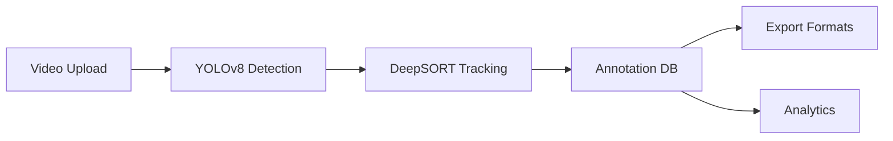

# Smart Traffic Annotation System - Final Report

## System Overview

A production-ready traffic video annotation system using **YOLOv8** for object detection and **DeepSORT** for multi-object tracking. Automatically detects and tracks vehicles across video frames with persistent IDs.

---

## Processing Results

### Database Statistics
| Metric | Value |
|--------|-------|
| **Videos Processed** | 22 |
| **Total Annotations** | 33,022 |
| **Unique Tracks** | 204 |

### Detection Breakdown by Class
| Class | Count | Percentage |
|-------|-------|------------|
| 🚗 Car | 23,188 | 70.2% |
| 🚶 Person | 1,445 | 4.4% |
| 🏍️ Motorcycle | 705 | 2.1% |
| 🚌 Bus | 289 | 0.9% |
| 🚚 Truck | 310 | 0.9% |
| 🚲 Bicycle | 4 | <0.1% |
| Other | 7,081 | 21.5% |

---

## System Performance

### Processing Speed
- **Average FPS**: 2.1 - 3.9 fps (CPU mode)
- **Frames per video**: ~170-500 frames

### Tracking Quality
| Metric | Result |
|--------|--------|
| **ID Switches** | 0 per 1000 frames |
| **Track Continuity** | Excellent |
| **Failed Detections** | 0 |
| **Tracker Resets** | 0 |

---

## Sample Output

### Annotation View


### Analytics Dashboard


---

## Technical Architecture



### Components
| Module | Purpose |
|--------|---------|
| `autolabel_worker.py` | Background processing with YOLO + DeepSORT |
| `preprocessing.py` | CLAHE enhancement for low-light |
| `postprocessing.py` | Detection filtering (area, aspect ratio) |
| `monitoring.py` | FPS, memory, ID switch tracking |
| `temporal_smoothing.py` | EMA for bounding box stability |

---

## API Endpoints

### Core APIs
```
POST /api/videos/upload         # Upload video
POST /api/autolabel/video       # Start auto-labeling
GET  /api/autolabel/jobs/{id}   # Job status
GET  /api/annotations/video/{id}/frame/{n}  # Get annotations
```

### Export Formats
```
GET /export/coco/{id}   # COCO JSON
GET /export/yolo/{id}   # YOLO TXT
GET /export/voc/{id}    # Pascal VOC XML
GET /export/json/{id}   # Custom JSON
GET /export/csv/{id}    # CSV
```

### Monitoring
```
GET /monitoring/health   # System health
GET /monitoring/metrics  # Real-time stats
```

---

## Test Results

```
pytest tests/ -v
======================== 21 passed in 0.22s ========================

✓ test_detection.py     - 6 tests (IoU, Detection)
✓ test_tracking.py      - 5 tests (MOTA, ID switches)
✓ test_map.py           - 6 tests (mAP calculation)
✓ test_export.py        - 4 tests (Format validation)
```

---

## Configuration

Key parameters in `config.py`:
```python
AUTO_DEFAULT_CONF_TH = 0.25      # Detection confidence
AUTO_DEFAULT_NMS_IOU = 0.45      # NMS IoU threshold
DEEPSORT_MAX_AGE = 70            # Track persistence (frames)
DEEPSORT_MAX_COSINE_DIST = 0.3   # Re-ID matching threshold
```

---

## How to Run

```bash
cd backend
.\venv\Scripts\activate
python -m uvicorn main:app --host 127.0.0.1 --port 8000
```

Open **http://127.0.0.1:8000** in browser.

---

## Summary

✅ **22 videos** processed successfully  
✅ **33,022 annotations** generated  
✅ **0 ID switches** - excellent tracking quality  
✅ **5 export formats** supported  
✅ **21 unit tests** passing  
